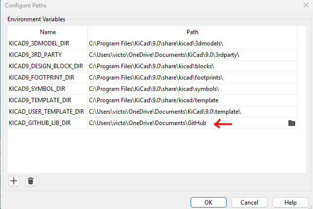
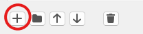
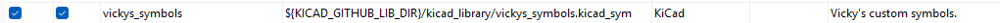
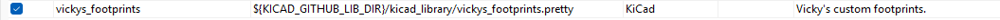

# kicad_library
Library of custom parts for various KiCad projects made by Vicky and used on loads of KiCad PCB projects! 

# How to Install
Once the library is cloned to your PC:
1. In KiCad, go to `Preferences >> Configure Paths`, and add your GitHub checkout location to your path. 

2. Then, in KiCad, go to `Preferences >> Manage Symbol Libraries...`
3. Choose whether you'd like the library to be Global or Project specific - I use this library across a range of projects, so I personally choose this library to be of Global level.
4. In the "Global Libraries" tab, press the '+' on the bottom left of the window. 

5. Add the new library on a new line as shown below and press OK. 

6. Repeat process, this time with the footprints library, by going to `Preferences >> Manage Footprints Libraries...`, then add the new library on a new line as shown below and press OK. _[1]_

_[1] It is important that the footprints library (.pretty) is not renamed, to ensure correct links between the symbol and footprint library parts._ 

# Part Properties
This library includes all the part properties within the symbol library, which also includes the links to the footprint library. 

The following properties are included in all the symbols when you go to `Symbol Editor >> Symbol Properties`:

| Name            | Value                                | Show                     |
| --------------- | ------------------------------------ | ------------------------ |
| Reference       | _eg. J, R, L, C, U_                  | :heavy_check_mark:       |
| Value           | _eg. 1u, 1K0, 100p, etc_             | :heavy_check_mark:       | 
| Footprint       | _vickys_footprints:{FOOTPRINT NAME}_ | :x:                      |
| Datasheet		    | _Appropriate datasheet link._        | :x:                      |
| Description     | _Succinct description of part._      | :x:                      |
| Manufacturer    | _Manufacturer name_                  | :x:                      |
| MPN             | _Manufacturer part number_           | :heavy_check_mark: / :x: |
| Mounting Type   | _SMT / THT_                          | :x:                      |
| RoHS            | _Y / N_                              | :x:                      |

